## 引子

前几天过生日，我家可爱送了我一个小米手环，它拥有监测人体心跳、压力、运动步数，长时间久坐提醒，甚至可以控制手机进行拍照支付播放音乐等功能，我感觉挺有意思，就了解了一下智能手环的发展历史和基本原理。

## 概念

智能手环是一种穿戴式智能设备。通过智能手环，用户可以记录日常生活中的锻炼、睡眠、部分还有饮食等实时数据，并将这些数据与手机、平板、ipod touch同步，起到通过数据指导健康生活的作用。 

## 发展历史

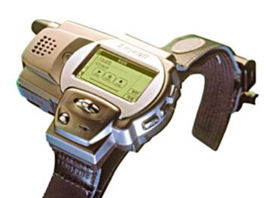

最早的智能手环类设备可以追溯到1999年，当时三星的这款SPH-WP10是跨时代的一个作品，它具有发送信息和拨打电话的功能。

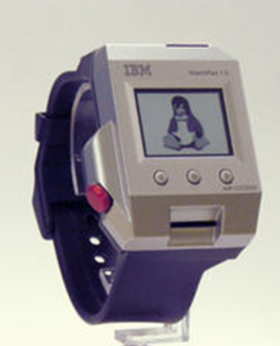

而后到2001年，IBM和日本的公司共同研发了 “IBM Watchpad” 这款产品，其中内置了日历和蓝牙功能，值得一提的是，如今的 APPLE WATCH 与它的样子很类似，个人推测应该有借鉴的地方。

之后的智能手环类设备有各种类型，我搜集了一些产品图片，可以欣赏一下

    

        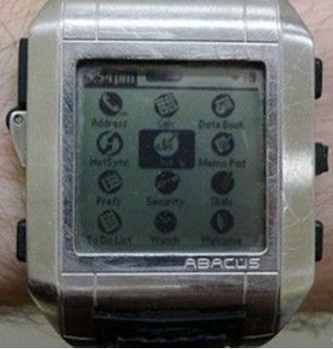
        Fossil Wrist PDA
    

    

        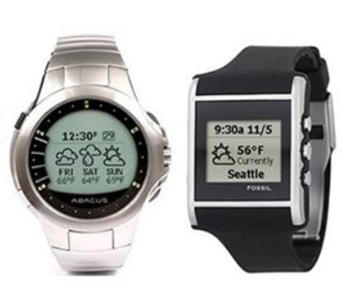
        微软SPOT系列
    

    

        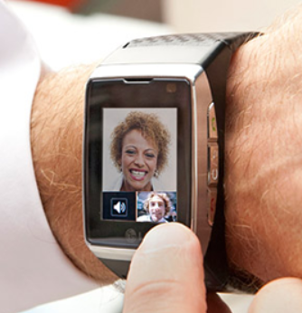
        LG GD910
    

    

        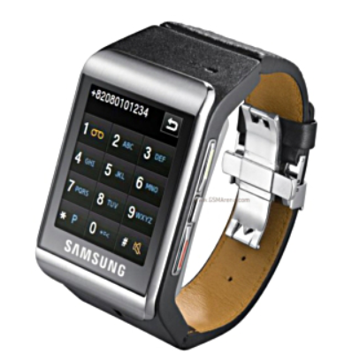
        三星S9110
    

    

        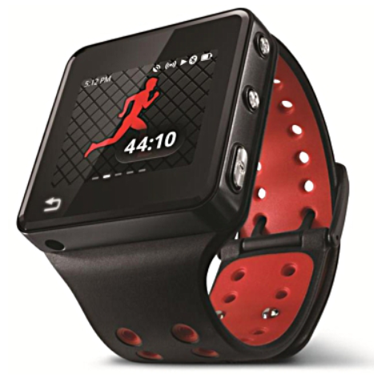
        摩托罗拉MotoACTV
    

    

        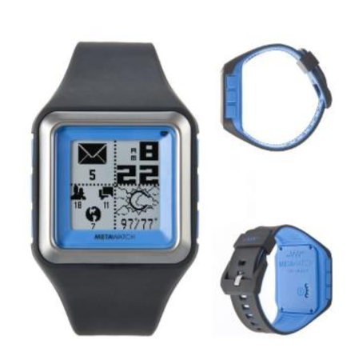
        Metawatch Strata
    

    

        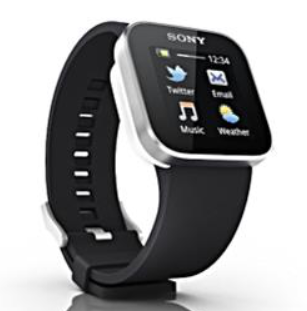
        索尼SmartWatch
    

    

        
        Apple Watch
    

    

        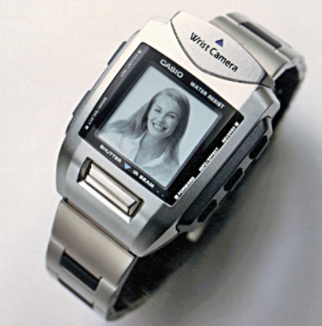
        卡西欧WQV系列
    

## 功能

现在的手环，基本都具有步数记录、心率检测、手机来电显示、支付等功能，我对这些功能做了一些了解。

### 计步原理

手环记录运动步数这个其实不是很稀奇，目前几乎所有手机都有这个功能，而且微信运动也会进行记录。这个功能我还是挺感兴趣的，因为我一直很想知道它是如何测算我是走了一步还是没走，如果我原地保持走路姿势运动，数据是否还会被记录，我们可以先看一下手机测步数的实现。

早期的计步器原理十分简单，由一个“震动传感器”和摆锤组成，摆锤类似于旧时的机械钟下的摆锤，当人在运动时，摆锤也会摆动，人走一步摆锤就会动一下，摆动的时候会和电极接触通电，震动传感器就会记录这一次的信号，进行累加，实现计步。

现代手机的计步原理主要是由陀螺仪、重力感应器和加速度传感器来实现计步，

**陀螺仪（英文：gyroscope）: 也叫角运动检测装置，是一种基于角动量守恒的理论，用来感测与维持方向的装置。陀螺仪主要是由一个位于轴心且可旋转的转子构成。由于转子的角动量，陀螺仪一旦开始旋转，即有抗拒方向改变的趋向。陀螺仪多用于导航、定位等系统。<a href="https://zh.wikipedia.org/wiki/%E9%99%80%E8%9E%BA%E5%84%80" target="blank">摘自某基百科</a>**

    

        
        定轴陀螺仪
    

    

        
        偏轴陀螺仪
    

**重力传感器:又称重力感应器，新型属传感器技术，它采用弹性敏感元件制成悬臂式位移器，与采用弹性敏感元件制成的储能弹簧来驱动电触点，完成从重力变化到电信号的转换。目前绝大多数中高端智能手机和平板电脑内置了重力传感器，如苹果的系列产品iphone和iPad， Android系列的手机等。<a href="https://baike.baidu.com/item/%E9%87%8D%E5%8A%9B%E6%84%9F%E5%BA%94%E5%99%A8" target="blank">摘自某度</a>**

    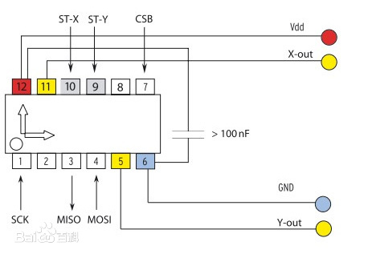
    重力传感器概述图

**加速度传感器:加速度传感器是一种能够测量加速度的传感器。通常由质量块、阻尼器、弹性元件、敏感元件和适调电路等部分组成。传感器在加速过程中，通过对质量块所受惯性力的测量，利用牛顿第二定律获得加速度值。<a href="https://baike.baidu.com/item/%E5%8A%A0%E9%80%9F%E5%BA%A6%E4%BC%A0%E6%84%9F%E5%99%A8" target="blank">摘自某度</a>**

